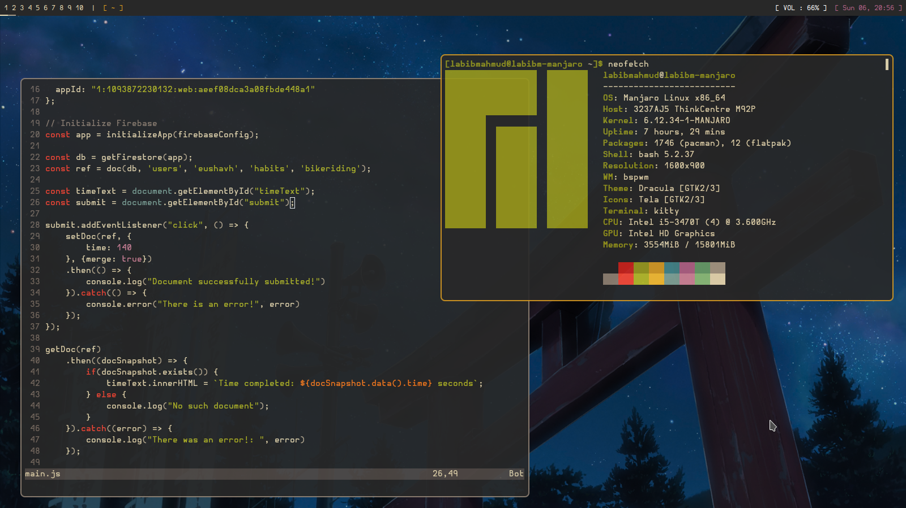

# BSPWM Configuration - 2025 Update

Cloned from 2022 BSPWM rice.


## Prerequisites

We will install the following:

- BSPWM and SXHKD
- feh
- fish
- nvim
- **picom ([ibhagwan fork](https://github.com/ibhagwan/picom))**
- **polybar**
- **rofi**
- kitty
- libnotify-dev
- Hermit Monospaced Font

*The bolded packages mean that those have to be compiled from source (on Debian/Ubuntu).*

## Installation

After installing all the packages listed above, move the files into the directories accordingly. For example, move all the directories in `.config` into `~/.config` in your setup.



### Installating Rofi
This is documented on the official repo: https://github.com/adi1090x/rofi

First, Make sure you have the same (stable) version of rofi installed.
- On Arch / Arch-based : sudo pacman -S rofi
- On Debian / Ubuntu : sudo apt-get install rofi
- On Fedora : sudo dnf install rofi

Then, Clone this repository -

` $ git clone --depth=1 https://github.com/adi1090x/rofi.git `

Change to cloned directory and make setup.sh executable -

```
$ cd rofi
$ chmod +x setup.sh
```
The only thing that I changed is the font. To change the font, go to `$HOME/.config/rofi/launchers/type-2/shared/fonts.rasi`. Use Hermit.

### Installing NeoVim
First, install neovim normally through your package manager. Once completed, install `vim-plug` from https://github.com/junegunn/vim-plug. Then, copy the four files into your own file system, and sync all the plugins by running: `:PlugInstall`.

To use the tree file browser, run `:NvimTreeOpen`.

## Script

I'm currently working on an installation script, called ***Yume***. My goal is to create a terminal GUI that helps you install my entire setup flawlessly. Currently, only the bash script is setup, so you can use that if you'd like. Yume is intended for Arch based systems, such as Arch Linux and Manjaro. (Sorry Debian users!)
