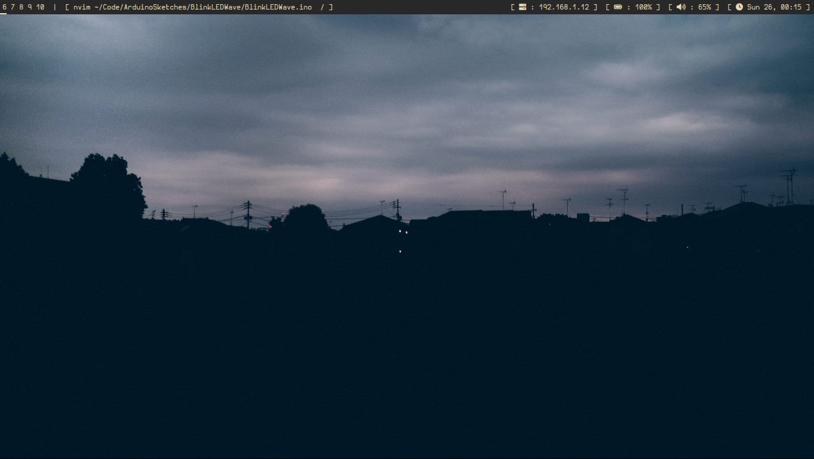
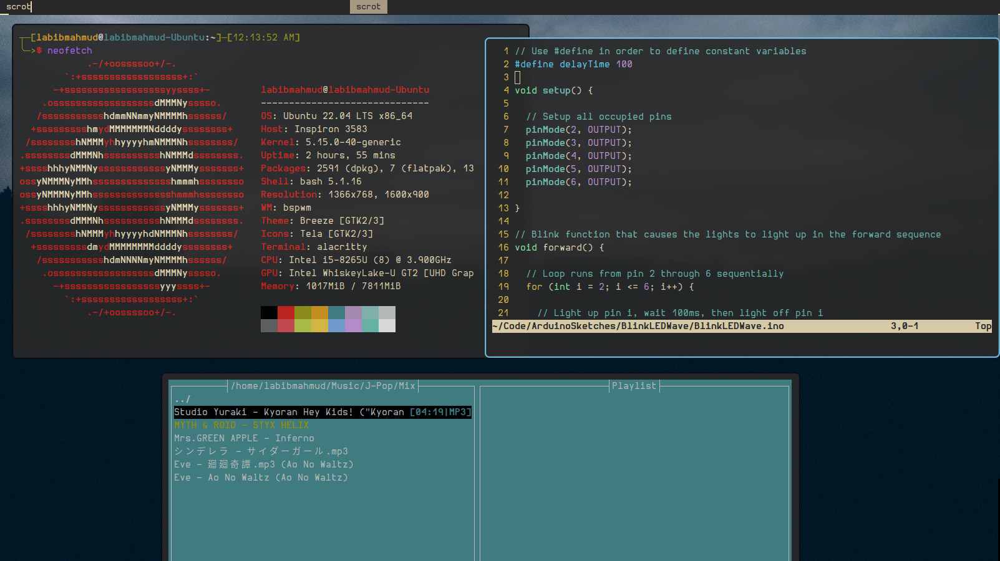

# BSPWM Configuration - 2022 Update

Welcome to my yearly window manager update. I'll admit, I've stopped using window managers on a long period of time. This and that happens, but I do miss using a window manager, so it's time to revisit BSPWM!

## Prerequisites

We will install the following:

- BSPWM and SXHKD
- feh
- fish
- nvim
- **picom ([ibhagwan fork](https://github.com/ibhagwan/picom))**
- **polybar**
- **dmenu**
- **alacritty**
- libnotify-dev
- Hermit Monospaced Font

*The bolded packages mean that those have to be compiled from source (on Debian/Ubuntu).*

## Installation

Honestly, I would like to include one-liner installers, but sadly I don't have the time for that. After installing all the packages listed above, move the files into the directories accordingly. For example, move all the directories in `.config` into `~/.config` in your setup.

## Script

I'm currently working on an installation script, called ***Yume***. My goal is to create a terminal GUI that helps you install my entire setup flawlessly. Currently, only the bash script is setup, so you can use that if you'd like. Yume is intended for Arch based systems, such as Arch Linux and Manjaro. (Sorry Debian users!)
